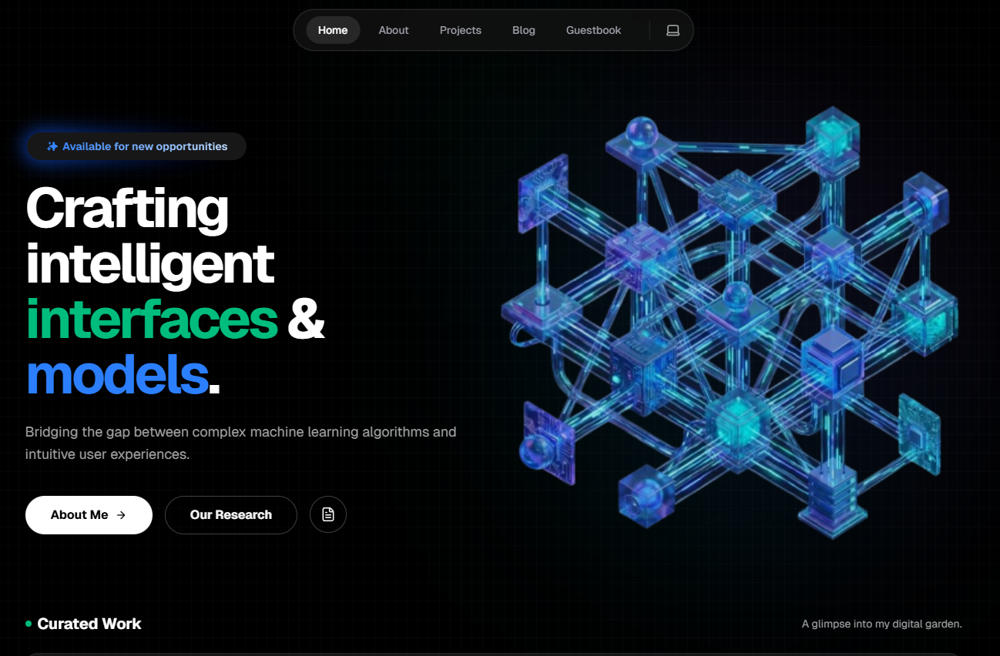
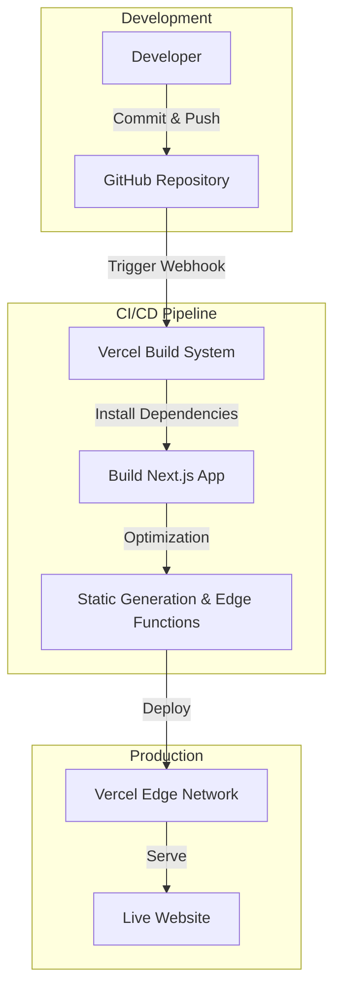

# Ageng's Portfolio v4 🚀

_Software Engineer & Data Scientist based in Surabaya, ID._

[](https://agengpp.vercel.app)
[](https://nextjs.org/)
[](https://tailwindcss.com/)
[](https://opensource.org/licenses/MIT)

A personal digital garden showcasing my work, writings, and digital products. Built with performance and aesthetics in mind.



## ⚡ PageSpeed Insights

Optimized for performance and user experience.

[Check Live Analysis](https://pagespeed.web.dev/analysis/https-agengpp-vercel-app/ow2af72dz5?form_factor=mobile)

| Metric | Score |
| :--- | :--- |
| **Performance** | 🟢 95+ |
| **Accessibility** | 🟢 100 |
| **Best Practices** | 🟢 100 |
| **SEO** | 🟢 100 |

## 🛠️ Tech Stack

- **Framework**: [Next.js 16](https://nextjs.org/) (App Router)
- **Styling**: [Tailwind CSS v4](https://tailwindcss.com/)
- **Animation**: [Framer Motion](https://www.framer.com/motion/)
- **Icons**: [Lucide React](https://lucide.dev/)
- **Content**: MDX
- **Deployment**: [Vercel](https://vercel.com)

## 🏗️ Architecture & Workflow

The development and deployment pipeline is streamlined using GitHub and Vercel.



## 🚀 Getting Started

To run this project locally:

1.  **Clone the repository**

    ```bash
    git clone https://github.com/pratama404/myweb.git
    cd myweb
    ```

2.  **Install dependencies**

    ```bash
    npm install
    # or
    yarn install
    # or
    pnpm install
    ```

3.  **Run development server**

    ```bash
    npm run dev
    ```

    Open [http://localhost:3000](http://localhost:3000) with your browser to see the result.

## 📂 Project Structure

A quick look at the top-level files and directories you'll see in this project.

```text
.
├── src/
│   ├── app/           # App Router pages and layouts
│   ├── components/    # Reusable UI components
│   ├── content/       # MDX content for blog/projects
│   ├── lib/           # Utility functions
│   └── styles/        # Global styles
├── public/            # Static assets
├── .eslintrc.json     # ESLint configuration
├── next.config.ts     # Next.js configuration
├── tailwind.config.ts # Tailwind CSS configuration
└── tsconfig.json      # TypeScript configuration
```

## 📜 License

### Content
<p xmlns:cc="http://creativecommons.org/ns#" >This work is licensed under <a href="https://creativecommons.org/licenses/by-nc-sa/4.0/?ref=chooser-v1" target="_blank" rel="license noopener noreferrer" style="display:inline-block;">CC BY-NC-SA 4.0</a></p>

### Source Code

[](https://opensource.org/licenses/MIT)

The source code is licensed under the [MIT License](LICENSE).

---

Based in Surabaya, Indonesia 🇮🇩 | © 2026 Ageng Putra Pratama
