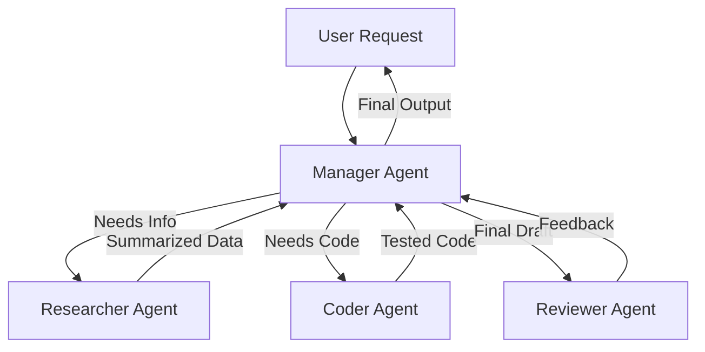

In late 2023, the world was obsessed with "Chat". We typed a prompt, and the AI hallucinated a poem. It was magical, but it was fundamentally **passive**.

Fast forward to 2026, and the conversation has shifted. We simply don't want an AI that *talks* about work; we want an AI that *does* the work.

This is the era of **Agentic AI**.

Over the past few months, I've been re-architecting my internal tools from simple RAG pipelines to fully autonomous agents—systems that don't just predict the next token, but predict the next **profitable action**.

Here is the documentation of that journey, dealing with the messiness of loops, tools, and memory.

<Features>
  <Feature
    title="ReAct Pattern"
    description="Reason + Act. The internal monologue that allows AI to 'think before it speaks'."
  />
  <Feature
    title="Tool Use"
    description="Giving LLMs hands: Executing SQL, browsing the live web, and running Python."
  />
  <Feature
    title="Semantic Memory"
    description="Moving beyond fixed context windows into infinite retrieval systems."
  />
  <Feature
    title="Swarm Orchestration"
    description="Simulating a digital company with specialized agent roles."
  />
</Features>

## 1. The "ReAct" Loop: The Ghost in the Machine

The fundamental difference between a Chatbot and an Agent is **Proprioception**—the awareness of its own thought process. A chatbot answers immediately. An agent pauses to think.

The **ReAct (Reason + Act)** pattern is the heartbeat of modern agents. It forces the model to engage in a step-by-step cognitive loop:

1.  **Thought**: "The user asked for the weather. I don't know it. I need to use a tool."
2.  **Action**: `WeatherAPI.get('Jakarta')`
3.  **Observation**: "API returned: 32°C, Heavy Rain."
4.  **Reflection**: "Okay, it's raining. I should suggest an umbrella."
5.  **Final Answer**: "It is currently 32°C and raining in Jakarta. Don't forget your umbrella! ☔"

```python
# The Agent Loop (Simplified)
while not task_complete:
    thought = llm.think(history)
    
    if is_tool_call(thought):
        tool = thought.get_tool()
        print(f"🔧 Agent is using {tool.name}...")
        result = tool.execute()
        history.append(Observation(result))
    else:
        return thought.final_answer()
```

When you look at the logs of a running agent, you're essentially watching it talk to itself. It's an eerie, fascinating glimpse into synthetic reasoning.

## 2. Tool Use: Giving the Brain "Hands"

An LLM without tools is a brain in a jar. It can dream about coding, but it can't commit to GitHub.

**Tool Use** (or Function Calling) is the bridge. We define structured JSON schemas that describe potential actions—`query_postgres`, `scrape_url`, `send_slack`—and the model learns to output specifically formatted text to trigger these functions.

<Callout type="warning" title="The Reliability Challenge">
  The hardest part isn't making the AI use the tool; it's making it handle the <strong>failure</strong> of a tool. What if the API timeout? A robust agent reads the error message, "thinks" about a workaround, and tries a different strategy—just like a human engineer would.
</Callout>

In my recent experiments building a **"Personal Research Assistant"**, I found that providing **granular, atomic tools** (e.g., `read_file`, `write_file`) yielded far better results than massive "magic" functions. It allows the agent to chain small victories into a completed complex task.

## 3. Multi-Agent Systems: The Digital Council

One Super-AI is good, but a team of specialized narrow AIs is better.

The **Multi-Agent Pattern** (popularized by frameworks like CrewAI and AutoGen) involves a "Manager" LLM that delegates tasks to specialized "Worker" agents.

*   **The Researcher**: Optimizes search queries and summarizes papers.
*   **The Coder**: Writes and tests Python scripts in a sandbox.
*   **The Reviewer**: Has no tools, but is prompted to be extremely critical and find bugs.



By separating concerns, we reduce the "context pollution" for each individual model. The Researcher doesn't need to know about Python syntax, and the Coder doesn't need to know about SEO strategies.

## 4. The Future: Autonomous Engineers

We are rapidly approaching the point where agents can maintain their own codebases. The concept of **Self-Healing Code**—where an agent detects a runtime error, reads the stack trace, locates the file, writes a fix, and deploys it—is no longer science fiction. It's a prototype running on my localhost right now.

The challenge ahead is **Control and Safety**. How do we ensure these autonomous loops don't spiral? The answer lies in better **Evals (Evaluation Frameworks)** and strict "Human-in-the-loop" checkpoints before critical actions (like `DROP DATABASE`).

### Closing Thoughts

Building Agentic AI is less about *Prompt Engineering* and more about **Systems Engineering**. It's about designing robust loops, reliable tools, and fail-safe memories.

The AI is the engine, but the Agentic Pattern is the chassis, wheels, and steering. And we're just learning how to drive.

<Callout type="success" title="Key Takeaway">
  Start thinking of AI not as a content generator to be chatted *with*, but as a logic engine to be integrated *into* your software's control flow.
</Callout>
